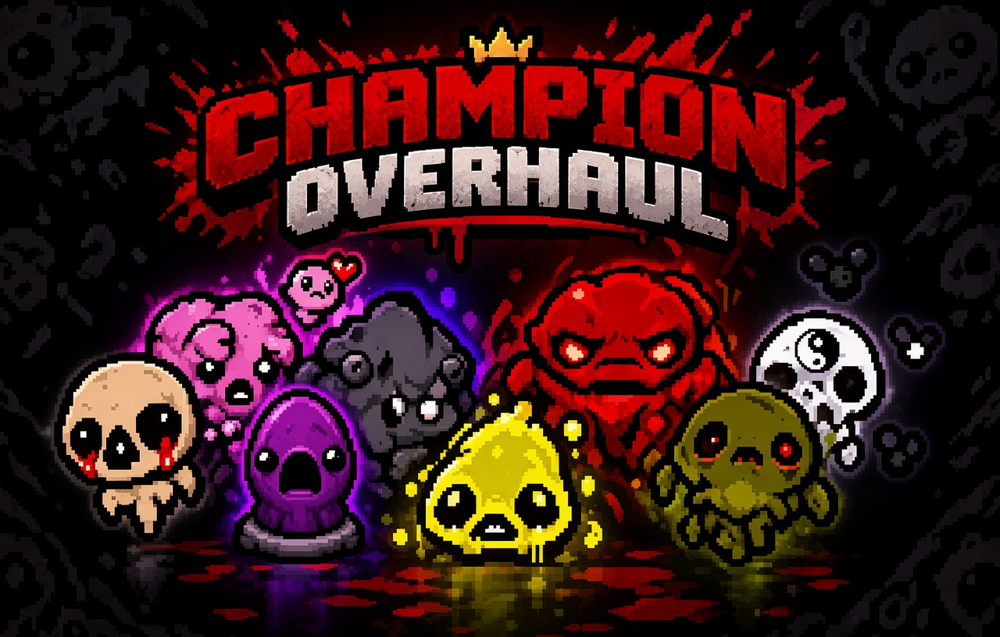

# Champion Overhaul

**Champion Overhaul** completely redesigns how enemy Champions work in Repentance+. The goal is to give Champions more personality, variety, and mechanical depth while expanding the system beyond the vanilla game. **A dedicated page documenting both vanilla and modded Champions is currently being developed**.

## ⚙️ System Redesign

All enemy Champions have been redesigned, including their:

- **Mechanics**
- **Drops**
- **Rarities**
- **Spawn conditions**
- **Attack patterns**

Vanilla Champions have been reworked to give their effects more identity, while the system also allows completely new Champions to be introduced. Champions retain the same size as their normal counterparts, but are significantly more dangerous:

- **2× base health**
- **1 full heart of contact damage**
- **2 full hearts of contact damage in Chapter 4+**

Damage changes also apply to **Boss Champions**.

### ⚖️ Champion Weight System

Champions use a **linear weighted selection system** to determine how frequently each Champion can appear. Each Champion is assigned a rarity represented by stars. The rarity determines its base weight:

| Rarity        | Stars | Weight |
| :------------ | :---- | :----: |
| **Common**    | ★★★★★ | `1.00` |
| **Uncommon**  | ★★★★  | `0.5`  |
| **Rare**      | ★★★   | `0.25` |
| **Very Rare** | ★★    | `0.1`  |
| **Legendary** | ★     | `0.01` |

When multiple Champions are eligible to spawn, their weights are compared against the total weight of all eligible Champions.

### 🔒 Rarity Unlocks

Very Rare and Legendary Champions have additional floor restrictions.

By default, **★★ Very Rare** and **★ Legendary** Champions only become eligible to spawn starting from **Floor 5**. If **Everything Is Harder** has been unlocked, these Champions can appear much earlier, starting from **Floor 2**.

## 🎨 Color Consistency

Champion colors have been improved using the **Repentance shader system**.

Instead of simply tinting the entity's sprite, Champion colors are injected through shaders. The pipeline is reworked to allow bright colors, providing a more consistent and accurate appearance across different entities and animations. This removes some of the shading layers from the process, but results in more concise coloring.

## 🧬 Inheritance

Champion properties are no longer limited to the Champion itself.

**Color and damage are inherited by its attacks and related entities.**

Depending on the Champion, you may encounter:

- Colorized **projectiles**
- Colorized **lasers**
- Modified **effects**
- Champion-specific attack behaviors
- Attacks that inherit the Champion's damage

This means a Champion's identity can extend beyond its body and into its entire attack pattern. Champion bosses share this feature too.

## ⚔️ Ambush

Champions can now appear as part of **enemy waves**.

They are able to spawn in situations such as **Challenge Rooms**, **Boss Rooms**, **Wave-based encounters** and other rooms using wave-like enemy layouts. This allows Champions to appear in more unexpected situations instead of being restricted to standard enemy spawns. The chance to spawn is base on the factor below:

$$ F = \frac{100 - 10B} {2^{E}(1 + P)} \times R $$

$$ P(\text{Champion}) = \frac{6}{\lfloor F \rfloor} $$

Wave-spawned enemies have a chance to become Champions. The base spawn factor is **100**, corresponding to a **6% chance**. Several mechanics can modify this factor: 

- **B** = number of **Champion Belts** 
- **P** = **Purple Heart** trinket multiplier
- **E** = number of unlocked **Everything Is Terrible** achievements. `[0,2]`
- **R** = Boss Room modifier: **Normal:** `R = 1`, **Boss Room:** `R = 2`

## 🔧 Minor Changes

**Ultra Hard Challenge** no longer have curses. With the new champion system, this challenge becomes even harder and let's face it, curses don't increase the game's difficulty; they just make it more annoying.

Some entity mechanics were changed to adapt to the changes, including:

* **Boil-like entities** regenerate health faster, but temporarily lose their ability to regenerate when taking damage.
* **Globins** are only able to revive three times. They instantly die if they attempt to revive again.
* **Baby Long Legs** are slower, preventing them from becoming too annoying or reaching insane speeds.
* **Turdling/Dangle/Brownie** are now immune to status effects in order to prevent them from killing themselves.

## 🐛 Debug:

In case you didn't know, there is no support for adding new enemy champions to the game. This mod allows for the addition of new content, using the Red Champion as an anchor to add or modify mechanics. In this new system, every enemy champion has a subtype value greater than 100; therefore, each champion's name is used for identification to avoid complications.

Champions can be spawned using the following command:

`champion <name> <type> <variant>` 

- **name:** Champions share their IDs by name rather than integer. 
- **type:** Entity type.
- **variant:** Entity variant (`0` by default).

Typing `champion` will display a few Champion names to choose from. You can get the complete list by using:

`champion list`

For example, to spawn a **Red Horf**, you can use:

`champion red 12`

You can use this command to test mechanics and help identify issues as well.

> [!NOTE] 
> Enemy champions no longer use vanilla spawn because their Champion IDs are hardcoded.
> Boss champions keep unchanged.
